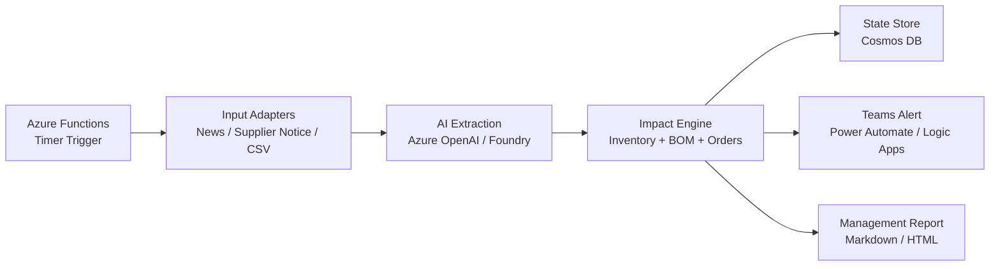

# Architecture

## Architecture Goal

Keep the architecture small, explainable, and aligned with hackathon requirements.

The product should feel like an autonomous monitoring agent, while the implementation remains a scheduled workflow that is easy to demo.

## Minimal Azure Architecture

## Components

### 1. Scheduler

Recommended service:

- Azure Functions Timer Trigger

Responsibility:

- Start monitoring workflow.
- Load new external signals.
- Re-evaluate unresolved alerts.

For local development, this can be a manual CLI command.

### 2. Input Adapters

MVP inputs:

- `data/samples/news_events.json`
- `data/samples/supplier_notices.json`
- `data/samples/inventory.csv`
- `data/samples/bom.csv`
- `data/samples/orders.csv`
- `data/samples/alternatives.csv`

Future inputs:

- News RSS
- Supplier email
- PDF notices
- ERP inventory
- PLM/BOM system
- CRM/order management

### 3. AI Extraction Agent

Recommended service:

- Microsoft Foundry
- Azure OpenAI
- Azure AI Agent Service if available

Responsibility:

- Summarize external signals.
- Extract structured risk event data.
- Produce evidence-backed reasoning.

The agent should output JSON for downstream calculation.

### 4. Impact Engine

Responsibility:

- Match risk material to BOM.
- Identify impacted products.
- Identify impacted plants.
- Calculate days of supply.
- Identify customer orders.
- Check approved alternatives.
- Calculate risk score.

This part should be deterministic and testable.

### 5. State Store

Recommended service:

- Azure Cosmos DB

MVP fallback:

- Local JSON file

Responsibility:

- Store alert history.
- Store unresolved alerts.
- Track generated reports.
- Track human approval status.

### 6. Notification And Workflow

Recommended services:

- Microsoft Teams
- Power Automate
- Logic Apps

Responsibility:

- Send alert.
- Post summary and evidence.
- Create response task or ticket.

### 7. Report Generator

Responsibility:

- Generate management summary.
- Include risk score, impact, evidence, and recommended actions.
- Avoid overclaiming prediction accuracy.

## Agentic Behavior

The product appears as a monitoring agent because it:

- Runs periodically.
- Keeps state across runs.
- Evaluates unresolved risks.
- Decides whether to alert.
- Prepares response recommendations.
- Escalates to humans only when needed.

## Cost-Minimal Development Path

1. Build locally with JSON/CSV files.
2. Use Azure OpenAI only for extraction and report text.
3. Use deterministic code for calculations.
4. Deploy only the orchestrator to Azure Functions.
5. Add Cosmos DB only when alert history needs persistence.
6. Use Teams webhook or Power Automate for notification.

## Security And Governance

For MVP:

- Do not store sensitive real company data.
- Use sample data.
- Keep generated actions as recommendations.
- Mark all final actions as human-approved.

For future production:

- Use Entra ID.
- Use managed identities.
- Add audit logs.
- Encrypt stored data.
- Add role-based access control.
