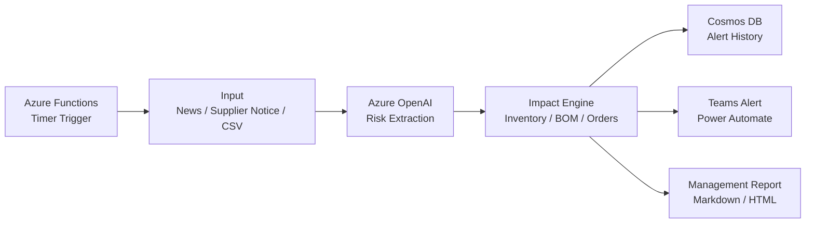

# Supply Sentinel ハッカソン勝ち筋マスタープラン

## 結論

Supply Sentinel は、外部ニュースを要約するAIではなく、外部で起き始めた供給リスクを自社の業務影響に翻訳する早期警戒型AIエージェントとして見せる。

勝ち筋は次の一点に絞る。

> 世界で起きている供給リスクを、自社の「止まる製品・困る顧客・残り日数・次の一手」に変換する。

## 審査員に伝えるべき価値

原材料不足は、調達部門だけの問題ではない。生産停止、納期遅延、顧客対応、売上影響まで広がる。

しかし現場では、ニュース、サプライヤ通知、在庫、BOM、受注情報が分散しており、初動判断に時間がかかる。

Supply Sentinel は、この初動調査を自動化し、人が判断するための材料を数分で揃える。

## 企画の中心メッセージ

従来のサプライチェーンAIは、自社内で発生した需要・在庫・配送のズレを最適化するものが多い。

Supply Sentinel は、自社外で発生し始めた危機の兆候を検知し、自社の在庫・BOM・代替材・受注情報と照合して、業務影響と初動対応を提示する。

つまり、計画修正AIではなく、早期警戒と初動加速のAIである。

## MVPでやること

対象シナリオはナフサ供給不安に限定する。

MVPで実装・デモする機能は次の6つ。

1. ナフサ供給不安のニュース/サプライヤ通知を読み込む。
2. Azure OpenAI でリスクイベントを構造化する。
3. 自社の在庫・BOM・受注・代替材データと照合する。
4. 影響製品、影響顧客、影響工場、在庫残日数を算出する。
5. リスクスコアと初動対応案を生成する。
6. Teams向けアラートと管理職向けレポートを出力する。

## MVPでやらないこと

勝つために、次はやらない。

- 株価予測
- SNS/X分析
- 需要予測
- 配送最適化
- 自動発注
- サプライヤ自動切替
- 本格ERP連携
- 全原材料への横展開
- 大規模ダッシュボード

ハッカソンでは、広く浅い機能よりも、一本の業務シナリオが気持ちよく通ることを優先する。

## 最小アーキテクチャ



## Microsoft要件への対応

| ハッカソン要件 | 採用技術 |
|---|---|
| アプリケーション実行基盤 | Azure Functions |
| Microsoft AI 技術 | Microsoft Foundry / Azure OpenAI |
| エージェント関連 | Azure AI Agent Service またはエージェント風オーケストレーション |
| 推奨データストア | Azure Cosmos DB |
| 通知・業務連携 | Microsoft Teams / Power Automate |
| 認証 | Microsoft Entra ID |
| 開発補助 | GitHub / GitHub Copilot |

## 業務設計

AIが自動で行うこと:

- 情報収集
- 要約
- リスク抽出
- 影響評価
- 対策案作成
- 通知文作成
- レポート作成
- チケット案作成

人が承認すること:

- 発注変更
- サプライヤ切替
- 顧客への正式通知
- 価格改定
- 生産計画の大幅変更

この分担により、実務導入の現実味を出す。

## リスクスコア

AIの雰囲気だけで危険判定しない。

リスク抽出はAI、影響判定はルールと計算で行う。

| 評価項目 | 点数 |
|---|---:|
| 外部イベント深刻度 | 30 |
| サプライヤ通知の信頼度 | 20 |
| 在庫残日数 | 25 |
| 顧客/受注優先度 | 15 |
| 代替材の有無 | 10 |
| 合計 | 100 |

## デモで見せる出力例

```text
リスクスコア: 82/100
対象原材料: ナフサ
在庫残日数: 5日
影響製品: Resin A, Solvent B
影響顧客: Customer Alpha, Customer Beta
影響工場: Chiba Plant
推奨初動:
- サプライヤへ割当数量を確認
- 優先顧客向け在庫を確保
- 承認済み代替材 NAP-ALT-01 の適用可否を確認
- 顧客説明用の一次案を準備
```

## 審査基準への刺し方

### ビジネスインパクト

原材料不足は調達、生産、営業、顧客対応にまたがる重大課題である。

Supply Sentinel は、影響製品・顧客・工場・在庫残日数を即時に整理し、初動判断を早める。

### アプローチの有効性

単なるチャットUIではなく、定期巡回、外部情報抽出、自社影響評価、通知、レポート生成まで行うエージェント型の仕組みである。

### 完成度・実現性

自動化範囲を「評価・通知・提案」に絞り、重要判断は人が承認する。既存業務に組み込みやすく、導入リスクが低い。

## 最後の決め台詞

Supply Sentinel の価値は、未来を完璧に当てることではありません。

価値は、外部で起きた危機を自社の業務影響に翻訳し、現場が動き出すまでの時間を短縮することです。
