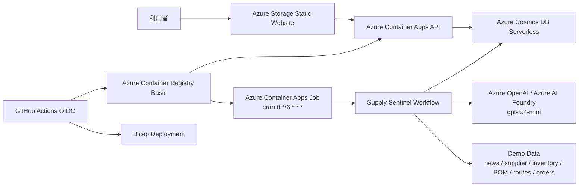
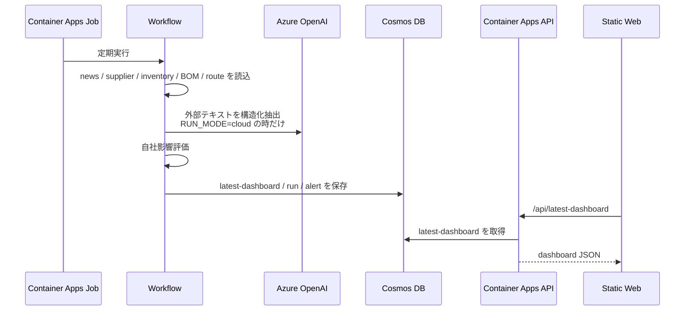

# Azure 基本設計

## 1. 最終アーキテクチャ

Supply Sentinel は、静的フロント、読み取り API、定期実行 Job、Cosmos DB、Azure OpenAI 境界を分けた最小構成で動かす。



## 2. 採用サービス

| 領域 | Azure サービス | 用途 |
| --- | --- | --- |
| フロント | Azure Storage Static Website | 3画面UIの配信 |
| API | Azure Container Apps Consumption | `/api/latest-dashboard` と `/api/health` |
| 定期実行 | Azure Container Apps Job | 6時間ごとの巡回エージェント |
| DB | Azure Cosmos DB for NoSQL Serverless | 最新結果、実行履歴、アラート履歴 |
| コンテナ | Azure Container Registry Basic | API/Job の同一イメージ管理 |
| AI | Azure OpenAI / Azure AI Foundry | Risk Extraction / Response Planning |
| ID | Microsoft Entra ID / Managed Identity | Cosmos、ACR、OpenAI への認証 |
| CI/CD | GitHub Actions + OIDC | secret なしのデプロイ |
| コスト | Azure Budget | 月 3,000 円アラート |

## 3. 実行フロー

1. GitHub Actions が Bicep をデプロイする。
2. GitHub runner 上で Docker image を build し、ACR に push する。
3. Container Apps API と Container Apps Job が同一 image に更新される。
4. Job が 6 時間ごとに `node src/run-demo.mjs` を実行する。
5. Workflow が外部シグナルと社内データを読み込む。
6. `RUN_MODE=demo` では deterministic extractor、`RUN_MODE=cloud` では Azure OpenAI を使う。
7. 影響評価結果を Cosmos DB に保存する。
8. フロントが API から最新ダッシュボードを取得する。

## 4. データフロー



## 5. AI 設計

### モデル

| 用途 | Deployment 名 | Azure model |
| --- | --- | --- |
| メインエージェント | `gpt-5.4-mini` | `gpt-5.4-mini` |
| サブエージェント | `gpt-5.4-mini` | `gpt-5.4-mini` |

Azure 上の正式モデル名はハイフン付きの `gpt-5.4-mini`。ユーザー向け説明で `gpt5.4 mini` と言う場合も、実装では Azure の deployment 名に合わせる。

### RUN_MODE

| mode | 動き |
| --- | --- |
| `demo` | deterministic mock。審査デモで安定して同じ結果を返す。 |
| `cloud` | Azure OpenAI に実リクエスト。East US 2 の `gpt-5.4-mini` deployment を利用。 |

### meta.ai

`buildDashboardModel()` は `meta.ai` を同梱する。

```json
{
  "meta": {
    "ai": {
      "provider": "Azure OpenAI",
      "model": "gpt-5.4-mini",
      "subagent_model": "gpt-5.4-mini",
      "run_mode": "demo",
      "inputs": [
        { "type": "news", "text": "..." },
        { "type": "supplier_notice", "text": "..." }
      ]
    }
  }
}
```

これにより、デモ画面で「AIが何を読んだか」と「どう構造化したか」を説明できる。

## 6. Cosmos DB 設計

単一 container `runs` に `pk` で用途を分けて保存する。

| pk | id 例 | 内容 |
| --- | --- | --- |
| `latest` | `latest-dashboard` | Web/API 用の最新 dashboard |
| `run` | `run-<alert_id>` | 実行ごとのリスクイベント、評価、レポート |
| `alert` | `alert-<alert_id>` | 未解決アラート履歴 |

local auth は disabled。Container Apps の Managed Identity に Cosmos DB Built-in Data Contributor を付与する。

## 7. API 設計

| Endpoint | 認証 | 内容 |
| --- | --- | --- |
| `GET /api/health` | public | 死活確認。機密情報なし。 |
| `GET /api/latest-dashboard` | public read-only | Cosmos DB の latest dashboard を返す。 |

デモ用途のため公開 read-only とする。書き込み API は作らない。

## 8. セキュリティ設計

- GitHub Actions は OIDC。client secret は作らない。
- ACR admin user は disabled。
- Cosmos DB local auth は disabled。
- Container Apps は User Assigned Managed Identity を使う。
- Azure OpenAI も Managed Identity + Cognitive Services OpenAI User でアクセスする。
- フロントには `apiBase` 以外の機密情報を置かない。

## 9. コスト設計

| リソース | コスト抑制 |
| --- | --- |
| Container Apps API | max 1 replica、0.25 CPU / 0.5Gi。 |
| Container Apps Job | 6時間ごと。常時起動しない。 |
| Cosmos DB | Serverless、少量ドキュメント。 |
| ACR | Basic。 |
| Storage | LRS、静的ファイルのみ。 |
| Log Analytics | 30日保持。 |
| Azure OpenAI | `gpt-5.4-mini` に限定し、短いプロンプトで実行。 |

## 10. 現実装との差分

| 項目 | ローカル / demo | Cloud |
| --- | --- | --- |
| 実行 | `node src/serve.mjs` / `npm run build:web` | Container Apps API + Container Apps Job |
| 状態 | `outputs/latest` / `web/dashboard_data.json` | Cosmos DB `runs` container |
| AI | deterministic extractor | Azure OpenAI `gpt-5.4-mini` |
| フロント | 静的JSON fallback | API `/api/latest-dashboard` |
| 認証 | なし | Managed Identity / OIDC |

## 11. デモで伝えるポイント

- 「常時監視っぽく見えるが、実装は低コストな定期巡回」
- 「AIが読んだ外部テキストを、構造化 RiskEvent に変換」
- 「社内在庫・BOM・受注・調達ルートと照合して、自社影響へ翻訳」
- 「AIは提案まで。重要判断は人が承認」
